## 项目背景

### 目的

作为深度纠结症患者，面对琳琅满目的选择，我们常常不知从何下手，每次选择电影的时间往往比看电影的时间还长。并且由于惯性思维，总是会选择自己熟悉的类型的影片，导致虽然不少电影已经看过四五遍，但是仍有许多电影从来都没有了解过。

因此，我们搭建了这个平台，让您摆脱选择困难症的困扰，为您带来全新的观影体验。

### 功能

我们的算法不仅会为您推荐那些备受瞩目的热门电影，更会挖掘隐藏的珍藏佳作，让您有机会发现您可能错过的宝藏片单。我们涵盖了各种类型的电影，从悬疑、科幻到传记和艺术片，无论您喜欢怎样类型的电影，我们都会为您找到最适合您口味的影片。

## 技术栈

### 技术总结

|                           | 主要功能                             |
| ------------------------- | ------------------------------------ |
| BeautifulSoup、Re模块     | 爬取电影榜单，提取数据               |
| MySQL                     | 存储并查找爬取到的数据和用户账户信息 |
| Flask框架                 | 定义视图函数并与URL绑定、处理请求    |
| Echarts库、 Bootstrap框架 | 实现数据可视化                       |

### 链接

1. [Bootstrap Admin Dashboard Templates - Start Bootstrap](https://startbootstrap.com/templates/admin-dashboard)
2. [Examples - Apache ECharts](https://echarts.apache.org/examples/zh/index.html)

## 项目预览

- 登陆/注册界面

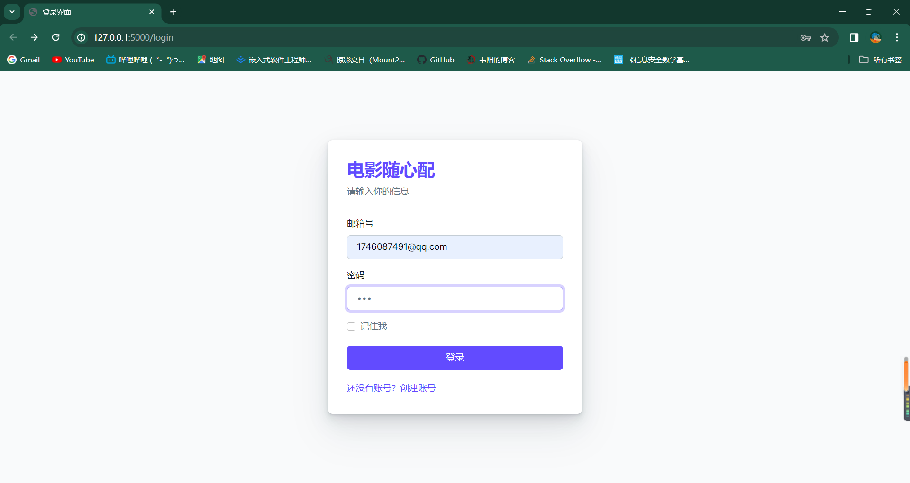

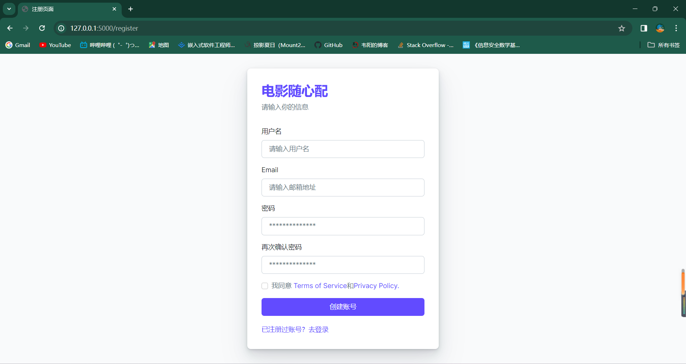

- 网页主页--随机推荐电影界面

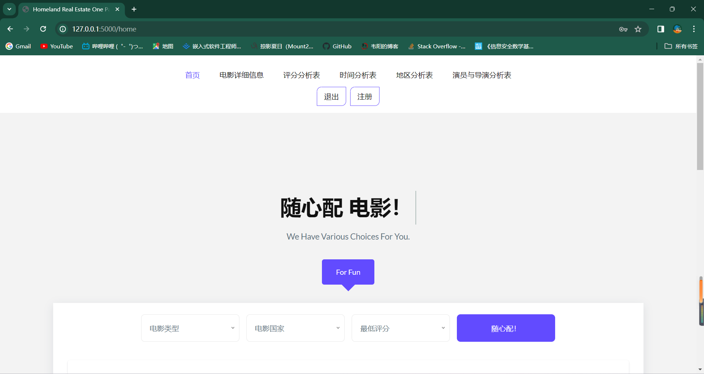

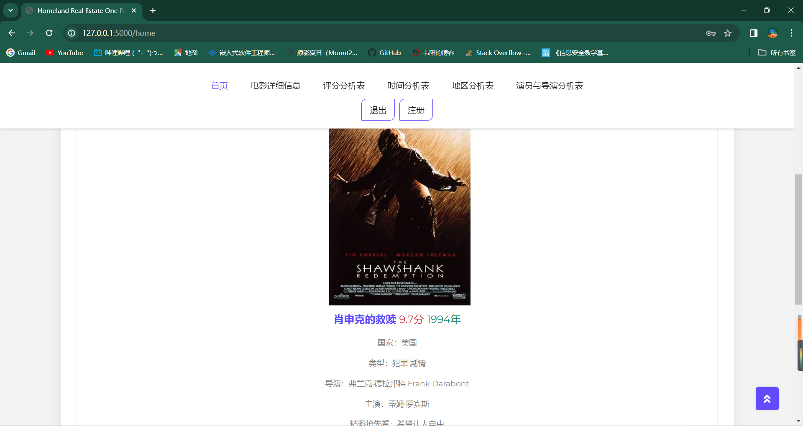

- 电影信息详情页

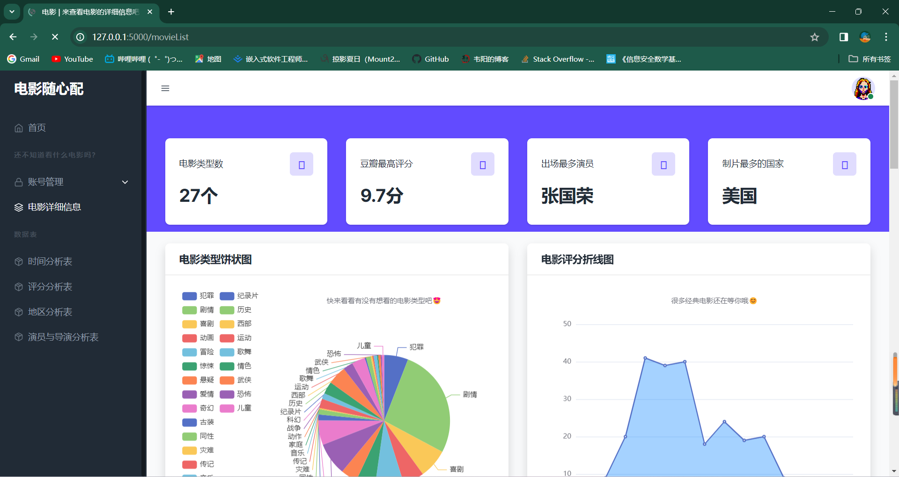

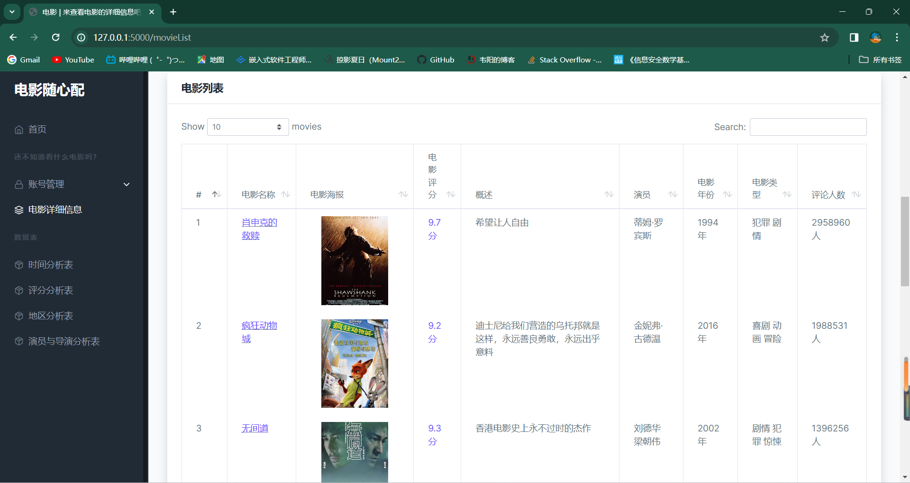

- 可视化部分

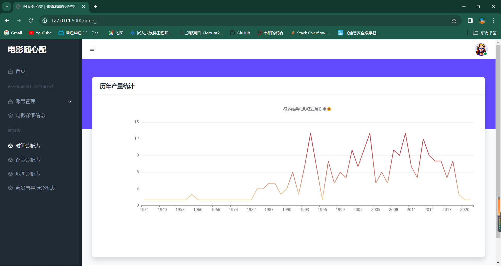

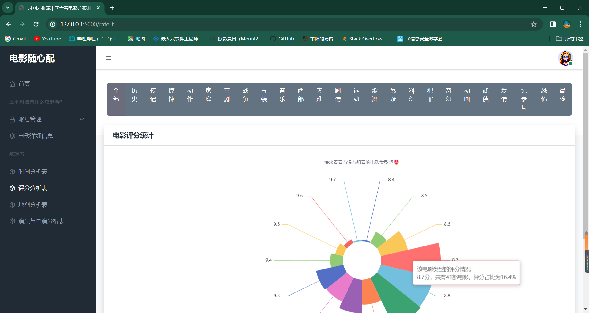

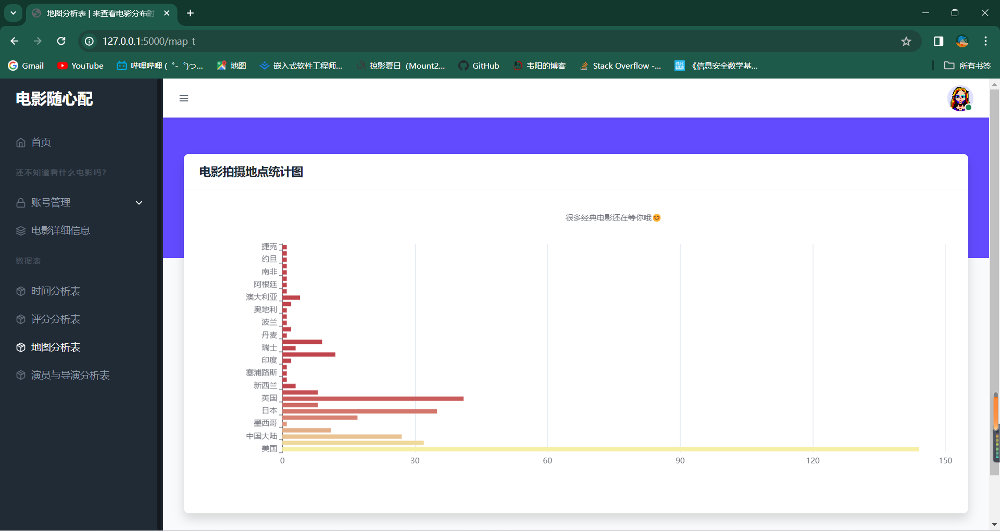

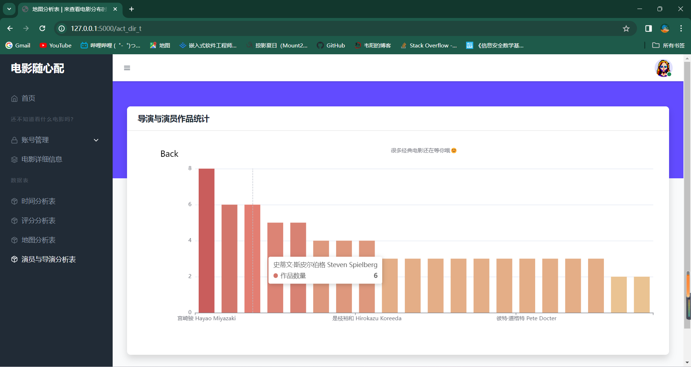

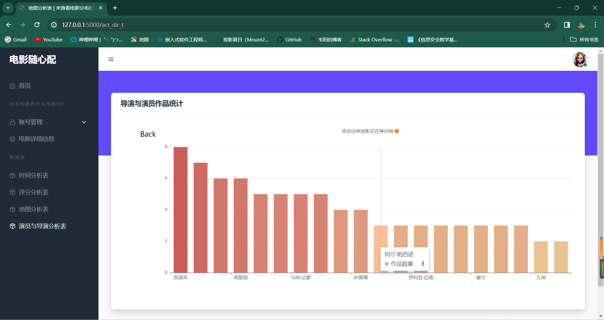
